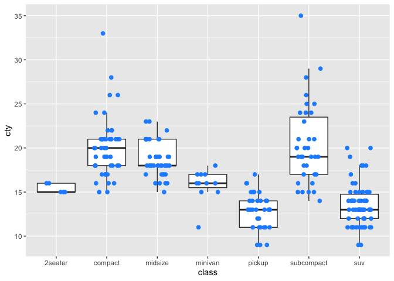
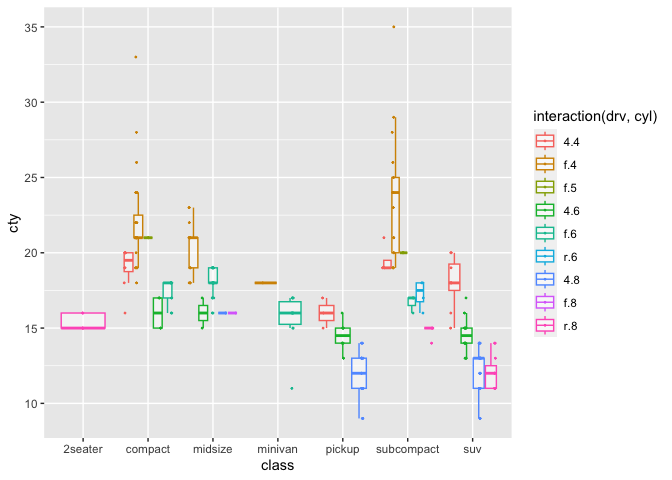
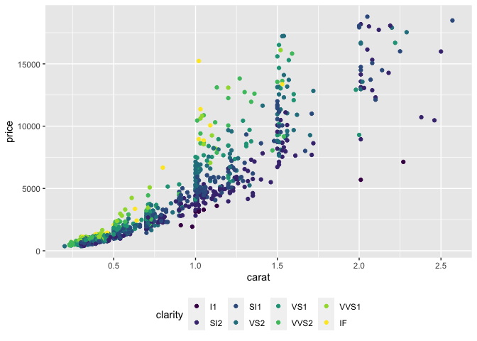
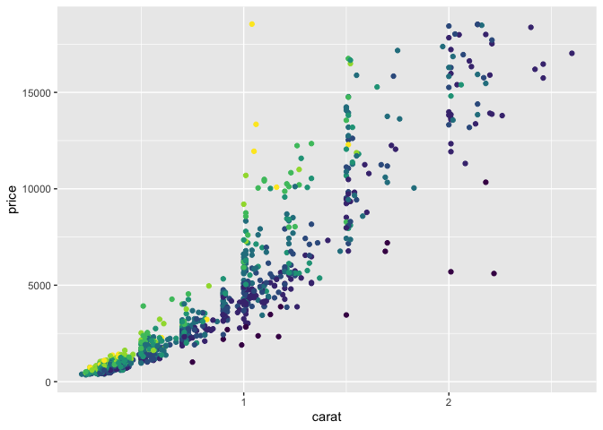
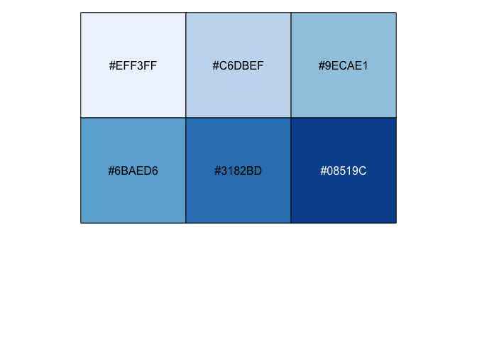

tidyExt package
================

# Handy wrappers and extensions for the tidyverse

<br> <br> The tidyverse is a user-friendly suite of R packages designed
to make data analysis simpler, less error-prone and more enjoyable. This
package contains a host of helper functions designed to minimize
keystrokes, and to overcome some comon pain-points in plotting, data
summarization and environment management.

<br>

# Installation

To install the development version, if required first install devtools

``` r
install.packages('devtools')
```

To install tidyExt:

``` r
devtools::install_github('bansell/tidyExt')
```

Load tidyverse and tidyExt:

``` r
library(tidyverse)
library(tidyExt)
```

<br>

# Source code & environment management

<br>

## printScriptDir()

To manage source code files across multiple systems and folders, it can
be useful to quickly print the entire path for the source file you are
working in, without quotes for quick copy/paste.

``` r
printScriptDir() 
```

    ## [1] "~/Git/tidyExt/tidyExt_vignette.Rmd"

NB run from your .R or .Rmd file, this function will not return the
characters “\#\# \[1\]” in the console.

<br>

## fix\_tidyverse\_conflicts()

Certain tidyverse functions like rename() and select() often conflict
with function names from other packages. If many packages are loaded, to
reset the tidyverse functions as the default, after use
fix\_tidyverse\_conflicts(). Thanks to Jacob Munro for this one.

``` r
fix_tidyverse_conflicts()
```

<br>

# Plotting

<br>

## geom\_boxjitter()

Make boxplots with overlaid datapoints. There is no jitter in the y axis
in order to accurately represent data values.

``` r
mpg %>% ggplot(aes(x=class, y=cty)) +
   geom_boxjitter( point_size = 2, point_col='dodger blue')
```

<!-- -->

<br>

## geom\_boxdodge()

Make nested boxplots with overlaid datapoints. There is no jitter in the
y axis in order to accurately represent data values.

``` r
mpg %>% ggplot(aes(x=class, y=cty, col=interaction(drv,cyl))) +
 geom_boxdodge()
```

<!-- -->

<br>

# statistricks!

…sorry. Here are some useful statistics shortcuts: <br>

## smooth\_lm()

Adds a linear regression line to scatter plot and calls ggpubr to print
the line equation and p value

``` r
mpg %>% ggplot(aes(cty,hwy)) + geom_point() + geom_smooth_lm()
```

    ## `geom_smooth()` using formula 'y ~ x'

<!-- -->

<br>

## scale\_this()

A wrapper for scale() that returns a single vector to use within
dplyr::mutate() etc. This function is copied from
[here](https://stackoverflow.com/a/35776313).

scale() output:

``` r
diamonds %>% mutate(table_scale = scale(table)) %>% select(table_scale) %>% str()
```

    ## tibble [53,940 × 1] (S3: tbl_df/tbl/data.frame)
    ##  $ table_scale: num [1:53940, 1] -1.1 1.586 3.376 0.243 0.243 ...
    ##   ..- attr(*, "scaled:center")= num 57.5
    ##   ..- attr(*, "scaled:scale")= num 2.23

scale\_this() output:

``` r
diamonds %>% mutate(table_scale = scale_this(table)) %>% select(table_scale) %>% str()
```

    ## tibble [53,940 × 1] (S3: tbl_df/tbl/data.frame)
    ##  $ table_scale: num [1:53940] -1.1 1.586 3.376 0.243 0.243 ...

<br>

## sort\_pct()

A way to simultaneously count and sort the relative proportion of
character data in descending order. Simple example:

``` r
diamonds %>% sort_pct(cut)
```

    ## # A tibble: 5 x 3
    ##   cut           n    pct
    ##   <ord>     <int>  <dbl>
    ## 1 Ideal     21551 0.400 
    ## 2 Premium   13791 0.256 
    ## 3 Very Good 12082 0.224 
    ## 4 Good       4906 0.0910
    ## 5 Fair       1610 0.0298

More complex:

``` r
diamonds %>% sort_pct(cut,color)
```

    ## # A tibble: 35 x 4
    ##    cut       color     n    pct
    ##    <ord>     <ord> <int>  <dbl>
    ##  1 Ideal     G      4884 0.0905
    ##  2 Ideal     E      3903 0.0724
    ##  3 Ideal     F      3826 0.0709
    ##  4 Ideal     H      3115 0.0577
    ##  5 Premium   G      2924 0.0542
    ##  6 Ideal     D      2834 0.0525
    ##  7 Very Good E      2400 0.0445
    ##  8 Premium   H      2360 0.0438
    ##  9 Premium   E      2337 0.0433
    ## 10 Premium   F      2331 0.0432
    ## # … with 25 more rows

<br>

# ggplot shortcuts

Minimize keystrokes for common plot label and legend modifications

<br>

## bottom\_legend

``` r
sample_n(diamonds,1000) %>% ggplot(aes(x=carat,y=price, col=clarity)) + geom_point() + bottom_legend
```

<!-- -->

<br>

## no\_legend

``` r
sample_n(diamonds,1000) %>% ggplot(aes(x=carat,y=price, col=clarity)) + geom_point() + no_legend
```

<!-- -->

<br>

## x\_angle30

Angle x axis labels at 30°

``` r
mpg %>% ggplot(aes(x=manufacturer,y=hwy)) + geom_boxjitter() + x_angle30
```

<!-- -->

<br>

## x\_angle45

Angle x axis labels at 45°

``` r
mpg %>% ggplot(aes(x=manufacturer,y=hwy)) + geom_boxjitter() + x_angle45
```

<!-- -->

<br>

## plot\_cycle\_col()

This function is useful when you want to make scatterplots (for example,
PCA plots) coloured by multiple different factors. The colour space is
rapidly exhausted and important plotting information is lost. For
example:

``` r
my_df <- mpg %>% mutate(year=factor(year), cyl=factor(cyl))

my_df %>% gather(key,value,year,cyl,drv,manufacturer) %>% 
   ggplot(aes(cty,hwy,col=value)) + geom_point() + facet_wrap(~key,ncol=2) +
   bottom_legend
```

<!-- -->

It is very hard to distinguish the data from years 1999 vs 2008, and the
figure legend is a jumble of labels from all facets.

To handle this, we recycling the default ggcolour scale to maximize the
contrast in each facet. Caution: be sure to check the legend under each
plot to avoid confusing the colour encodings between facets.

First create a vector containing the column names of interest for
colouring points in the scatterplot

``` r
my_features <- c('year','drv','cyl','manufacturer')
```

``` r
my_df <- mpg %>% mutate(year=factor(year), cyl=factor(cyl))

plot_cycle_col(df = my_df,  X='cty',Y='hwy', myLabel = 'manufacturer', colour_vec = my_features)
```

<!-- -->

<br>

# Colour scales

Creating and modifying colour scales can be hard work in ggplot2. These
functions help to print the HEX codes and display the swatch for the
selected colours, from default ggplot2 or RColorBrewer palettes.

<br>

## default\_GG\_col

``` r
default_GG_col(12)
```

<!-- -->

    ##  [1] "#F8766D" "#DE8C00" "#B79F00" "#7CAE00" "#00BA38" "#00C08B" "#00BFC4"
    ##  [8] "#00B4F0" "#619CFF" "#C77CFF" "#F564E3" "#FF64B0"

<br>

## brewer\_GG\_col

First check out the palette information to see all of the available
Brewer palettes.

``` r
RColorBrewer::brewer.pal.info
```

    ##          maxcolors category colorblind
    ## BrBG            11      div       TRUE
    ## PiYG            11      div       TRUE
    ## PRGn            11      div       TRUE
    ## PuOr            11      div       TRUE
    ## RdBu            11      div       TRUE
    ## RdGy            11      div      FALSE
    ## RdYlBu          11      div       TRUE
    ## RdYlGn          11      div      FALSE
    ## Spectral        11      div      FALSE
    ## Accent           8     qual      FALSE
    ## Dark2            8     qual       TRUE
    ## Paired          12     qual       TRUE
    ## Pastel1          9     qual      FALSE
    ## Pastel2          8     qual      FALSE
    ## Set1             9     qual      FALSE
    ## Set2             8     qual       TRUE
    ## Set3            12     qual      FALSE
    ## Blues            9      seq       TRUE
    ## BuGn             9      seq       TRUE
    ## BuPu             9      seq       TRUE
    ## GnBu             9      seq       TRUE
    ## Greens           9      seq       TRUE
    ## Greys            9      seq       TRUE
    ## Oranges          9      seq       TRUE
    ## OrRd             9      seq       TRUE
    ## PuBu             9      seq       TRUE
    ## PuBuGn           9      seq       TRUE
    ## PuRd             9      seq       TRUE
    ## Purples          9      seq       TRUE
    ## RdPu             9      seq       TRUE
    ## Reds             9      seq       TRUE
    ## YlGn             9      seq       TRUE
    ## YlGnBu           9      seq       TRUE
    ## YlOrBr           9      seq       TRUE
    ## YlOrRd           9      seq       TRUE

``` r
brewer_GG_col(6,'Blues')
```

<!-- -->

    ## [1] "#EFF3FF" "#C6DBEF" "#9ECAE1" "#6BAED6" "#3182BD" "#08519C"

``` r
brewer_GG_col(4,'Paired')
```

<!-- -->

    ## [1] "#A6CEE3" "#1F78B4" "#B2DF8A" "#33A02C"

``` r
brewer_GG_col(4,'RdYlBu')
```

<!-- -->

    ## [1] "#D7191C" "#FDAE61" "#ABD9E9" "#2C7BB6"

<br>

# Data views

<br>

## bighead()

The utils::head() function will print all column names which can flood
the console. For large matrices in particular, its often useful to check
the top left corner of the matrix. *bighead(n)* prints a square data
frame of dimensions n X n.

``` r
diamond_mat <- as.matrix(diamonds[sample(1000), ])

diamond_mat %>% bighead()
```

    ## # A tibble: 6 x 6
    ##   carat cut       color clarity depth table
    ##   <chr> <chr>     <chr> <chr>   <chr> <chr>
    ## 1 0.72  Premium   E     VS2     58.3  58.0 
    ## 2 0.70  Premium   F     VS2     58.7  61.0 
    ## 3 0.71  Very Good F     VS1     62.2  58.0 
    ## 4 0.83  Good      I     VS2     64.6  54.0 
    ## 5 0.72  Premium   F     VS1     58.8  60.0 
    ## 6 0.79  Premium   E     VS2     60.6  53.0

NB this will return an 8x8 data frame as default when run in .R or .Rmd.

<br>

## print\_all()

The default console output for tidyverse tables is to display 6 rows of
data. Use *print\_all()* to output the entire table in the console. This
is useful for data frames of intermediate size (7-100 rows) instead of
modifying print() or using *View()*.

``` r
mpg %>% print_all()
```

NB Not run here. This will print the entire table to the console when
called from the console, a .R or .Rmd file.

<br>

# Summary

We hope these functions are useful for making your daily R coding work
quicker and easier! Please don’t hesitate to modify for your own use or
suggest updates through github.
